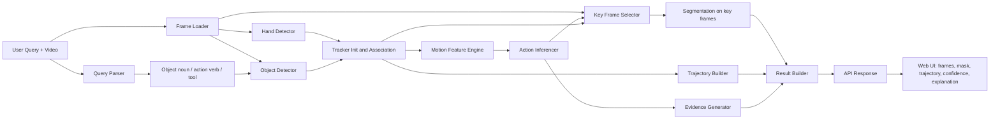
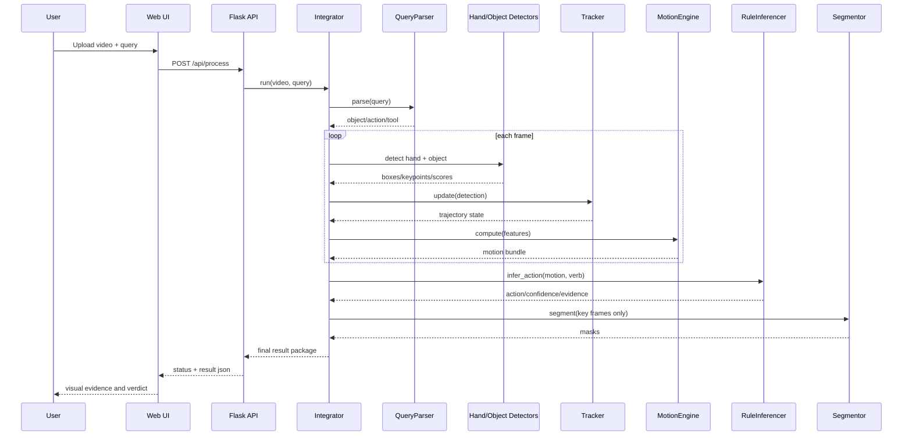

# FIBA AI Master Project Document

Version: 1.0
Date: 2026-04-06
Team: Atul, Tanishk, Yash
Project: Find-it-by-Action (FIBA AI)

## 1. Executive overview
FIBA AI is a zero-shot, edge-friendly action retrieval system that takes:
- raw egocentric or third-person video
- a natural language query (for example: "cutting onion", "opening box")

It returns:
- whether the queried action occurred
- where it occurred in time
- visual evidence (key frames, masks/boxes, trajectory)
- explainable motion logic (for example: "rotation detected -> opening inferred")

Core strategy:
- Do not use heavy end-to-end action transformers as the primary inference path.
- Use text-conditioned object localization + lightweight tracking + interpretable motion/state-change logic.
- Keep it deployable on laptop/mobile edge hardware.

## 2. Problem statement alignment (from official brief)
The official brief requires a system that:
1. Takes video + text query.
2. Detects the active/manipulated object.
3. Tracks it across frames.
4. Infers queried action with motion logic (not heavy ML).
5. Produces explainable visual output.

Expected deliverables from brief:
- Working demo (video + query -> result)
- Visual output:
  - bounding box or mask on active object
  - key frames or short clips
- Brief logic explanation
  - example: "Detected rotation -> inferred opening"
- Optional UI (Gradio/Web app)

Resource hints from brief:
- MediaPipe for real-time hand detection
- WeDetect/object-from-text detector option
- Edge TAM for segmentation+tracking
- SAM2 few-shot segmentation
- Reference dataset from Georgia Tech FPV videos

## 3. Final novelty statement
Proposed novelty for FIBA AI:

"Query-grounded, object-centric, explainable action retrieval on edge devices using state-change and motion evidence instead of heavy end-to-end action recognition."

Why this is novel in hackathon context:
- Most generic pipelines classify actions globally from clip features.
- FIBA AI retrieves action moments by tracking a query-relevant object and proving state transition with interpretable signals.
- This directly satisfies explainability and edge constraints.

## 4. Research synthesis (best-of-two merge)
This section consolidates strongest points from:
- Atul research summary (broad literature + deployment/benchmark depth)
- Yash research summary (highly targeted architecture for this exact brief)

### 4.1 What to keep from Atul research
1. Strong edge deployment discipline:
- Quantization/pruning/distillation
- TFLite/ONNX/TensorRT paths
- latency/power benchmarking by hardware

2. Broad detector and temporal model landscape:
- YOLOv8n, NanoDet, EfficientDet-Lite
- TSM and lightweight temporal alternatives

3. Data and evaluation rigor:
- dataset strategy
- annotation schema
- risk analysis and mitigation

### 4.2 What to keep from Yash research
1. Directly brief-matching architecture:
- text-grounded object detection
- ByteTrack-style tracking
- MobileSAM key-frame segmentation
- motion/state-change inferencing

2. Strong explanation-driven outputs:
- key-frame extraction
- trajectory visualization
- confidence + evidence text

3. Clear "avoid heavy transformer primary path" direction:
- maintain mobile/laptop practicality

### 4.3 Final merged decision
Primary runtime path:
- query parser -> lightweight object detector + hand detector -> tracker -> motion engine -> rule-based inferencer -> key frame/mask renderer -> web output

Secondary optional baseline path:
- Grounding DINO Edge, XMem, TSM/MoViNets for benchmarking or fallback experiments (not mandatory main runtime path)

## 5. End-to-end architecture

### 5.1 System flow diagram


### 5.2 Runtime sequence


### 5.3 Team module ownership
- Atul:
  - Query parser
  - Hand detector
  - Object detector
- Tanishk:
  - Tracker
  - Motion engine
  - Action inferencer
  - Segmentor
- Yash:
  - Integrator orchestration
  - Flask backend APIs
  - Web UI and rendering

## 6. Module specifications (detailed)

### 6.1 Query parser
Inputs:
- raw string query

Outputs:
- action verb
- action category
- target object noun
- optional tool noun

Design choices:
- lightweight regex/token based parser with stop-word filtering
- tool inference map from action category
- no cloud/LLM dependency

### 6.2 Hand detector
Inputs:
- frame

Outputs:
- hand bbox
- wrist/index/thumb keypoints
- handedness and confidence

Design choices:
- MediaPipe Hands for speed and low model footprint
- 21 keypoint geometry for contact logic and explainability

### 6.3 Object detector
Inputs:
- frame
- query object noun
- optional hand prior

Outputs:
- best query-relevant object bbox
- label
- detection confidence
- grounding confidence

Selection logic:
- weighted score:

$$
Score = 0.5 \cdot Similarity(label, query) + 0.3 \cdot Proximity(hand, object) + 0.2 \cdot detection\_conf
$$

- fallback heuristics if query object is weakly detected

### 6.4 Tracker
Inputs:
- per-frame object detections

Outputs:
- stable track id
- bbox/center/area history
- tracking confidence

Design choices:
- IoU association + Kalman prediction
- ByteTrack-inspired retention of lower-score detections for robustness
- track continuity despite short occlusion

### 6.5 Motion engine
Features computed:
- translation magnitude/direction/speed
- rotation proxy
- area ratio/variance/growth
- hand-object contact distance/frequency/events
- state-change score (early vs late window)

State change scoring concept:
$$
state\_change = \alpha \cdot area\_delta + \beta \cdot position\_delta + \gamma \cdot rotation\_delta
$$
with normalization and clipping to [0,1].

### 6.6 Action inferencer
Rule-based action scoring per class family:
- CUT: repeated contact + fragmentation + local stability
- OPEN: rotation + expansion + state-change
- POUR: tilt/rotation + vertical/lateral displacement
- PICK: upward motion + close hand-object coupling
- PLACE: downward motion + stabilization
- MIX: oscillatory rotational signature + contact pattern

Output:
- action_detected bool
- action_label
- confidence
- evidence text string

### 6.7 Segmentor
Goal:
- provide clean visual evidence masks on selected key frames

Design choices:
- MobileSAM when available
- GrabCut fallback when weights unavailable
- run only on key frames or low-trust moments to preserve latency

### 6.8 Integrator and API layer
Responsibilities:
- orchestrate all modules
- maintain progress callbacks
- assemble result payload
- expose API endpoints

Key endpoints:
- POST /api/process
- GET /api/status/<job_id>
- GET /api/stream/<job_id>

## 7. Contract between modules
Canonical frame-level contract:
```json
{
  "frame_id": 0,
  "timestamp_ms": 0.0,
  "query": {
    "verb": "cutting",
    "category": "CUT",
    "object": "onion",
    "tool": "knife"
  },
  "hand": {
    "detected": true,
    "hand_bbox": [0, 0, 0, 0],
    "wrist_pos": [0, 0]
  },
  "object": {
    "detected": true,
    "object_bbox": [0, 0, 0, 0],
    "object_label": "onion",
    "detection_confidence": 0.0,
    "grounding_score": 0.0
  },
  "track": {
    "track_id": 1,
    "center": [0, 0],
    "tracking_confidence": 0.0
  },
  "motion": {
    "rotation_change": 0.0,
    "area_ratio": 1.0,
    "state_change_score": 0.0
  }
}
```

## 8. Performance and edge targets
Target budget:
- End-to-end frame path (excluding optional segmentation): under 100 ms/frame on CPU-class edge
- Detector + hand + tracker + motion + inferencer should remain low-latency
- Segmentation is sparse (key frames only)

Memory target:
- keep deployed model stack compact
- avoid heavy always-on transformer backbones in primary path

## 9. Evaluation plan

### 9.1 Metrics
1. Action retrieval quality:
- detection accuracy/F1
- temporal localization (start/end overlap if annotations available)

2. Object pipeline quality:
- queried object grounding correctness
- tracking continuity under occlusion

3. Edge performance:
- average latency and p95 latency
- memory footprint
- optional power profiling on selected hardware

4. Explainability quality:
- consistency between evidence text and visual key frames

### 9.2 Benchmark hardware matrix
- laptop CPU baseline
- optional Jetson/Edge TPU benchmark (if available)
- optional mobile NNAPI test path

### 9.3 Dataset strategy
Primary:
- quick internal clips for target actions (cut/open/pour/pick/place/mix)

External references (from research):
- EPIC-Kitchens
- Something-Something v2
- HOI4D
- DexYCB
- ChildPlay-Hand
- TACO

Annotation schema:
- action segments
- object bbox (optionally mask)
- hand bbox/keypoints
- track ids for continuity checks

## 10. Risks and mitigation
1. Query object not in detector vocabulary
- Mitigation: fallback lexical mapping + offline pseudo-labeling + fine-tune tiny detector.

2. Tracking drift
- Mitigation: periodic re-detection and confidence-based reset.

3. Ambiguous motion cues
- Mitigation: combine multiple feature families (rotation + area + contact).

4. Edge latency spikes
- Mitigation: reduced frame rate processing, smaller input resolution, sparse segmentation.

5. Data scarcity
- Mitigation: focused capture of action classes, augmentation, transfer learning.

## 11. GitHub main repo setup (3 contributors)
Current local status:
- Git initialized in this workspace on `main`.

### 11.1 Create remote repository (once, by one teammate)
If using GitHub CLI:
```bash
gh auth login
gh repo create FIBA-AI --private --source . --remote origin --push
```

If creating remote manually on github.com:
1. Create empty repo named `FIBA-AI`.
2. Run:
```bash
git remote add origin https://github.com/<your-org-or-user>/FIBA-AI.git
git add .
git commit -m "docs: initialize FIBA AI architecture and design baseline"
git push -u origin main
```

### 11.2 Team contribution workflow
1. Each member creates personal feature branch:
```bash
git checkout -b feature/<name>-<scope>
```
2. Push branch and open PR to main.
3. Require at least 1 teammate review before merge.
4. Merge using squash for clean history.

### 11.3 Recommended branch policy
- Protect `main` from direct pushes.
- Require pull request review.
- Require status checks (lint/test/docs check once code is added).

## 12. Delivery checklist against brief

### 12.1 Must-have checklist
- [x] Video + text query input path
- [x] Active object detection from query
- [x] Track object across frames
- [x] Infer action using motion logic
- [x] Working demo path (Flask + web UI)
- [x] Visual output with bbox/mask, key frames, trajectory
- [x] Explainable evidence text

### 12.2 Nice-to-have checklist
- [x] Optional web UI
- [x] Segmentation fallback path
- [ ] Full mobile benchmark report (to be executed)
- [ ] Full power benchmark (to be executed)

## 13. Gap report from audit (important)
During verification, the current markdown stack is strong on architecture and implementation contracts, but still missing these high-value additions from research best practices:

1. Deployment optimization details are not deeply integrated in core design docs:
- quantization plan
- pruning/distillation plan
- per-device deployment matrix

2. Evaluation protocol is currently lightweight:
- lacks formal metric table and benchmark harness details
- lacks p95 latency and robustness scenario definitions

3. Alternative baseline experiments are not formalized:
- Grounding DINO Edge baseline as oracle benchmark
- XMem/TSM/MoViNets fallback experiment protocol

This master document includes these missing pieces so your final submission is stronger.

## 14. Demo script (judge-facing)
1. Open web app.
2. Upload video A + query "cutting onion".
3. Show:
- detected interval
- 3 key frames
- object trajectory
- evidence text (contact repetition + fragmentation)

4. Upload video B + query "opening box".
5. Show:
- rotation evidence
- area/state change
- "rotation detected -> opening inferred"

6. Highlight edge readiness:
- local/offline runtime
- lightweight modular pipeline
- explainability over black-box predictions

## 15. Project execution plan (short timeline)
Week 1:
- finalize interfaces and baseline integration
- record/collect first validation clips

Week 2:
- stabilize tracker + motion rules
- calibrate thresholds per action

Week 3:
- optimize latency and robustness
- add benchmark logging and result dashboard

Week 4:
- final QA, demo scripting, submission material packaging

## 16. Questions to resolve quickly
1. Which hardware is the official demo target (laptop CPU only, or laptop + mobile)?
2. Should fallback segmentation be mandatory in demo or optional switch?
3. Do judges require strict temporal IoU metric, or qualitative localization is acceptable?
4. Is internet guaranteed at venue, or must all model assets be pre-bundled offline?

## 17. Immediate next actions
1. Push this baseline repo to GitHub remote.
2. Create 3 feature branches and assign module tickets.
3. Add a small synthetic benchmark script for latency and confidence logging.
4. Record two polished demo videos aligned with query examples in brief.
